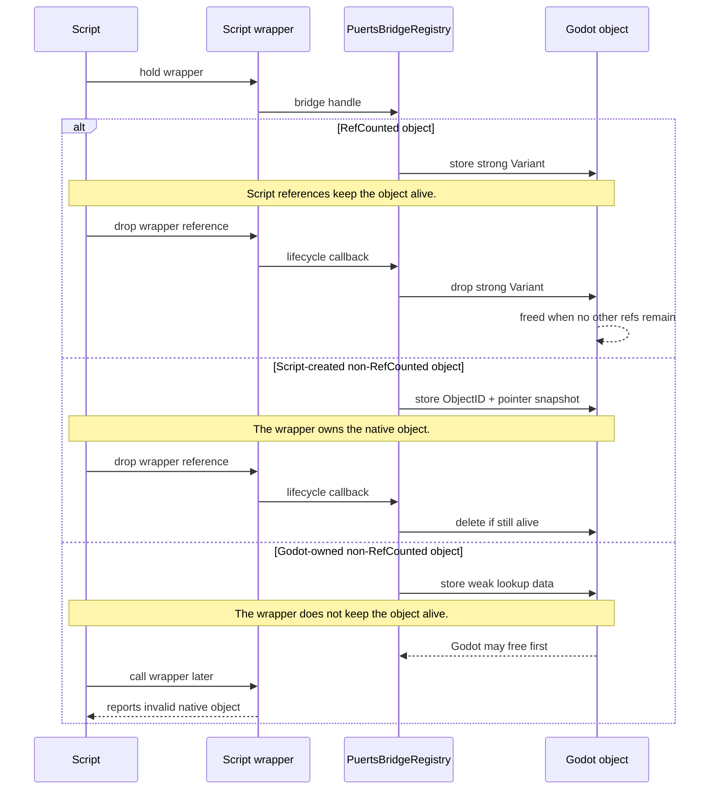
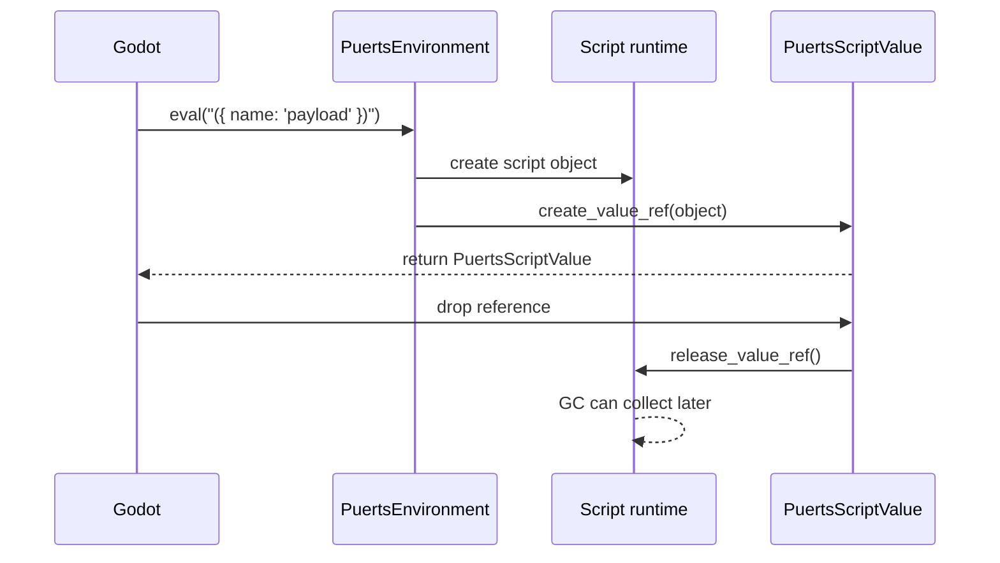
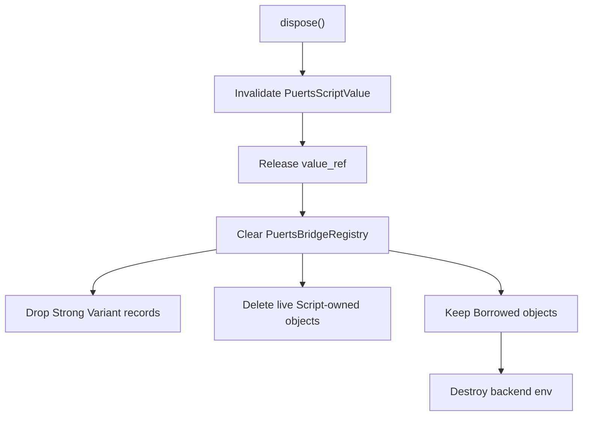

# Object Allocation and Lifetime

This page describes the object lifetime rules that matter when values cross the Godot and script boundary.

## Script-Held Godot Objects

A script wrapper holds a bridge handle. The handle points to a `PuertsBridgeRegistry` record. That record decides whether a script reference keeps the Godot object alive.

Read the diagram by ownership:

| Ownership | Script reference effect |
|-----------|-------------------------|
| `Strong` | Keeps the Godot object alive through a strong `Variant`. |
| `Script` | Owns the native object and deletes it when the wrapper is released. |
| `Borrowed` | Does not keep the native object alive. Godot may free it first. |

## Godot-Held Script Values

APIs such as `eval`, `get_global`, `get_property`, `call`, and `call_method` can return `PuertsScriptValue`. It owns a backend `value_ref`. While Godot holds it, the script value stays alive.

After Godot releases `PuertsScriptValue`, the script value can be collected if script has no other reference.

## Environment Disposal

`PuertsEnvironment.dispose()` is the hard boundary. It invalidates Godot-side script values, clears bridge records, and releases backend state.

After disposal, `PuertsScriptValue.is_valid()` returns `false`.

## Common Mistakes and Recommended Practice

### Assuming every script wrapper keeps a `Node` alive

Treat non-`RefCounted` objects as explicitly owned. Prefer Godot-owned `Node` objects when the scene tree owns lifetime.

### Creating a `Node` in script and dropping the wrapper

Keep the script wrapper alive while the node should live, or create the node through Godot-side code that owns it from the start.

### Using `Object` for shared data

Prefer `RefCounted` for data shared across Godot and script. Script references then keep the object alive through `Strong` ownership.

### Keeping long-lived `PuertsScriptValue` references by default

Store `PuertsScriptValue` only when Godot must keep a script value alive. Drop it when the value is no longer needed.

### Expecting old values to work after `dispose()`

Treat `dispose()` as terminal. Create a new environment and reacquire script values after disposal.
