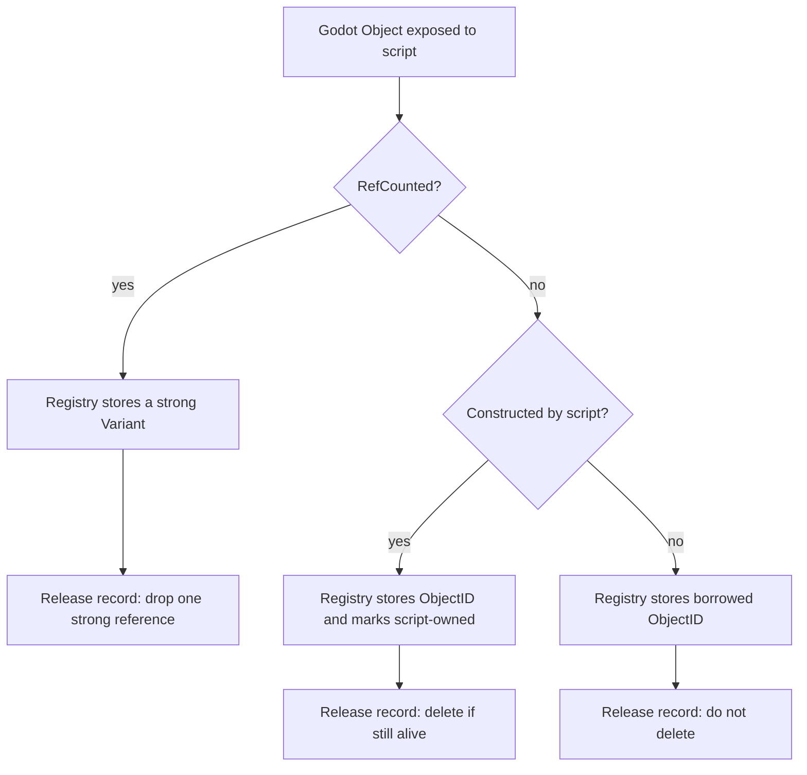
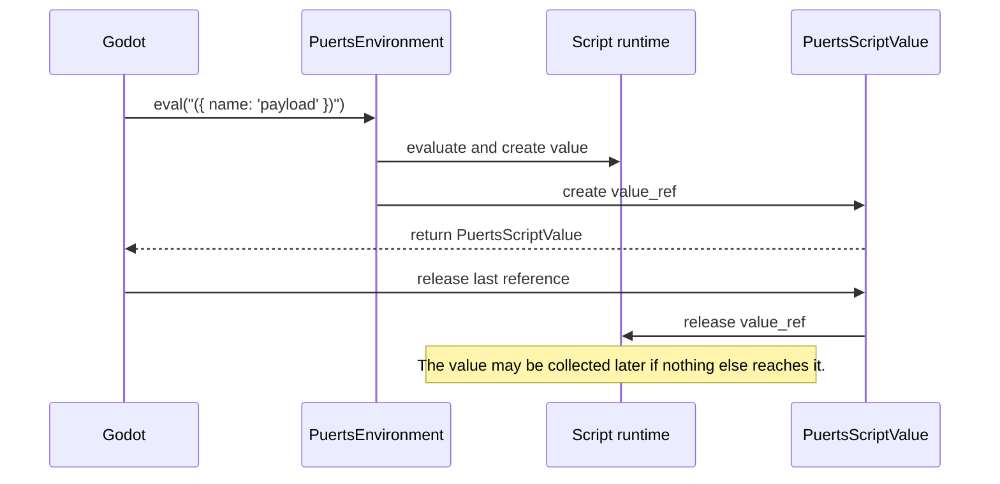

# Object Allocation and Lifetime

This page describes the lifetime rules for Godot objects and script values that cross a `PuertsEnvironment` boundary.

The two directions are independent:

- A Godot value exposed to script is tracked by the environment's bridge registry.
- A script value retained by Godot is tracked by a `PuertsScriptValue`.

## Godot Values Exposed to Script

When a Godot `Object` or boxed `Variant` crosses the environment boundary, its script wrapper carries a bridge handle. Within one environment, `PuertsBridgeRegistry` reuses the same object record when the same Godot object crosses the boundary again. When the runtime finalizes the native wrapper, its native-binding lifecycle callback releases that record.

Dropping a script variable does not necessarily release the record immediately. The wrapper must first become unreachable, and the backend decides when garbage collection and finalization run. Disposing the environment is the deterministic cleanup boundary.

### Godot `Object` instances

The lifetime rule depends on whether the object is `RefCounted` and where a non-`RefCounted` object was constructed:

| Native value | What the registry stores | Lifetime while exposed to script |
|--------------|--------------------------|----------------------------------|
| Any `RefCounted` object | A strong object `Variant` | The registry contributes one strong reference. Releasing the script wrapper drops that reference; the object is destroyed only when no other strong references remain. |
| Non-`RefCounted` object constructed by script | Its `ObjectID`, marked script-owned | The bridge deletes the object when the script wrapper is finalized, or when the environment is disposed, provided the object is still alive. |
| Non-`RefCounted` object passed in from Godot | Its `ObjectID`, not marked script-owned | The wrapper is borrowed and does not keep the object alive. Godot remains responsible for its lifetime. |

For non-`RefCounted` objects, the registry resolves the `ObjectID` through Godot's `ObjectDB` each time it needs the native object. It does not retain a raw pointer snapshot. If Godot frees a borrowed object first, `unwrap_native()` returns `null`, and later property or method access reports `Native object is no longer valid.`

`RefCounted` objects constructed by script use the same strong-reference rule as `RefCounted` objects passed from Godot. They do not need the explicit script-owned deletion path.



### Built-in `Variant` values

Built-in values passed from Godot that require native wrappers, such as `Vector2`, are stored as boxed `Variant` copies. The copy remains alive until the script wrapper is finalized or the environment is disposed. A built-in value constructed directly in script is allocated and finalized by its static binding instead of this bridge-registry path.

## Script Values Retained by Godot

`eval()` and `get_global()` return `PuertsScriptValue`. The `get_property()`, `call()`, and `call_method()` methods on a `PuertsScriptValue` return another `PuertsScriptValue`.

Each valid `PuertsScriptValue` owns a backend `value_ref`. As long as Godot retains the `PuertsScriptValue`, that reference keeps the corresponding script value reachable. Releasing the last Godot reference releases the `value_ref`; the script value can then be collected if the script runtime has no other reference to it.

Releasing a `PuertsScriptValue` permits collection but does not force an immediate garbage-collection cycle.



## Environment Disposal and Reinitialization

`PuertsEnvironment.dispose()` ends the current runtime generation. Cleanup occurs in this order:

1. Mark the environment as no longer alive.
2. Invalidate every `PuertsScriptValue` created by this environment and release its `value_ref`.
3. Clear the bridge registry:
   - drop strong `Variant` references for `RefCounted` objects;
   - delete still-live, script-owned non-`RefCounted` objects;
   - release boxed built-in values;
   - forget borrowed objects without deleting them.
4. Destroy the backend environment and release backend state.

If `dispose()` is requested while a script operation is active, destruction is deferred until that operation finishes. After disposal completes, `is_alive()` is `false` and every old `PuertsScriptValue.is_valid()` is `false`.

The same `PuertsEnvironment` instance may be initialized again. Reinitialization creates a new runtime generation; values obtained from an earlier generation remain invalid and must be reacquired.

## Concrete Lifecycle Examples

The following examples assume `_env` is initialized with `PuertsV8Backend`, as shown in [Getting Started](getting-started.md). They use a `WeakRef` so that object destruction is observable without keeping the object alive.

Garbage collection is deliberately pumped in these examples to make the transitions visible in a small test. Application code should not depend on a particular number of collection cycles.

```gdscript
func _pump_v8_gc() -> void:
	for _i in range(8):
		_env.eval("(function () { if (typeof gc === 'function') gc(); return 0; })()")
		_env.low_memory_notification()
		_env.tick()
```

### Script creates a `RefCounted`

Here JS creates a `RefCounted` and stores its wrapper in a global variable. Godot observes the native object only through a weak reference.

```gdscript
func example_script_refcounted() -> void:
	var id_value := _env.eval("""
		(function () {
			const RefCounted = load_type('RefCounted');
			globalThis.stats = new RefCounted();
			return globalThis.stats.get_instance_id();
		})()
	""")

	var native_object := instance_from_id(id_value.to_int())
	var lifetime: WeakRef = weakref(native_object)
	native_object = null
	id_value = null

	_pump_v8_gc()
	assert(lifetime.get_ref() != null) # JS wrapper keeps the registry record alive.

	_env.eval("globalThis.stats = undefined")
	_pump_v8_gc()
	assert(lifetime.get_ref() == null) # Finalizer drops the registry's strong reference.
```

The lifecycle is:

1. `new RefCounted()` creates the native object and its JS wrapper.
2. The bridge registry stores a strong `Variant` reference to the object.
3. `globalThis.stats` keeps the wrapper reachable, so the object survives collection.
4. Clearing the global makes the wrapper collectible.
5. The wrapper finalizer releases the registry record. With no other strong reference, Godot destroys the `RefCounted`.

If Godot also kept `native_object` instead of assigning `null`, the object would survive step 5 until that Godot reference was released.

### Script creates a `Node`

A `Node` is not `RefCounted`. A node constructed by script is therefore marked script-owned and is deleted when its wrapper is finalized.

```gdscript
func example_script_node() -> void:
	var id_value := _env.eval("""
		(function () {
			const Node = load_type('Node');
			globalThis.enemy = new Node();
			return globalThis.enemy.get_instance_id();
		})()
	""")

	var native_node := instance_from_id(id_value.to_int())
	var lifetime: WeakRef = weakref(native_node)
	native_node = null
	id_value = null

	_pump_v8_gc()
	assert(lifetime.get_ref() != null)

	_env.eval("globalThis.enemy = undefined")
	_pump_v8_gc()
	assert(lifetime.get_ref() == null) # The bridge deletes the script-owned Node.
```

Adding this node to the scene tree does not change its bridge ownership. If the JS wrapper becomes unreachable, the bridge can still delete the node. Keep the wrapper reachable for the required lifetime, or create the node on the Godot side when Godot should own it.

### Godot lends an existing `Node` to script

The direction of creation changes the rule. This node is created by Godot, so its script wrapper is borrowed and does not keep it alive.

```gdscript
func example_borrowed_node() -> void:
	var engine_node := Node.new()
	var lifetime: WeakRef = weakref(engine_node)
	_env.set_global("engine_node", engine_node)

	var script_wrapper := _env.get_global("engine_node")
	assert(script_wrapper.unwrap_native() == engine_node)

	engine_node.free() # Godot may destroy it while JS still holds the wrapper.
	assert(lifetime.get_ref() == null)
	assert(script_wrapper.unwrap_native() == null)

	# Logs: "Native object is no longer valid."
	script_wrapper.get_property("name")
```

The JS wrapper remains a valid script value, but it no longer resolves to a native object. The bridge stores an `ObjectID`, not a retained raw pointer, so `unwrap_native()` safely returns `null` after `free()`.

### Godot retains a script object

In this example the JS local `ref` would normally become unreachable when the IIFE returns. The returned `PuertsScriptValue` keeps the containing JS object, and therefore `ref`, alive from the Godot side.

```gdscript
func example_godot_holds_script_value() -> void:
	var held_value := _env.eval("""
		(function () {
			const RefCounted = load_type('RefCounted');
			const ref = new RefCounted();
			return { id: ref.get_instance_id(), ref };
		})()
	""")

	var id_value := held_value.get_property("id")
	var native_object := instance_from_id(id_value.to_int())
	var lifetime: WeakRef = weakref(native_object)
	native_object = null
	id_value = null

	_pump_v8_gc()
	assert(lifetime.get_ref() != null) # held_value's value_ref keeps the JS graph alive.

	held_value = null # Releases the last Godot value_ref.
	_pump_v8_gc()
	assert(lifetime.get_ref() == null)
```

This is the opposite boundary direction from the first three examples: `PuertsScriptValue` keeps a script value reachable, while the bridge registry keeps native values reachable according to their Godot ownership rules.

### `dispose()` is the deterministic boundary

GC timing varies, but environment disposal does not. It invalidates retained script values and releases objects owned only by that environment.

```gdscript
var value := _env.eval("({ answer: 42 })")
assert(value.is_valid())

_env.dispose()

assert(not _env.is_alive())
assert(not value.is_valid())
```

These transitions are also covered by the runnable [`lifecycle_suite.gd`](../tests/tests/suites/lifecycle_suite.gd), including script-created `RefCounted` objects, script-created `Node` objects, borrowed Godot nodes, retained `PuertsScriptValue` instances, and environment disposal.

## Practical Rules

### Prefer `RefCounted` for shared data

Use `RefCounted` for data that Godot and script should retain independently. A script wrapper then participates in the normal strong-reference lifetime.

### Treat script-constructed `Node` objects as script-owned

Creating a `Node` in script marks it script-owned. Adding that node to the scene tree does not transfer the bridge record to the borrowed path. Keep its script wrapper reachable for as long as the node must remain alive, or construct and own the node on the Godot side before exposing it to script.

### Treat Godot-provided non-`RefCounted` objects as borrowed

A script reference does not keep a Godot-provided `Node` or plain `Object` alive. Do not use its wrapper after Godot has freed the native object.

### Retain `PuertsScriptValue` only when needed

Keep a `PuertsScriptValue` when Godot needs to preserve or interact with a script value later. Release it when that relationship ends so the runtime can collect the value.

### Reacquire values after reinitialization

Disposal permanently invalidates values from that runtime generation. After initializing the environment again, evaluate or fetch the required values again instead of reusing old wrappers.
